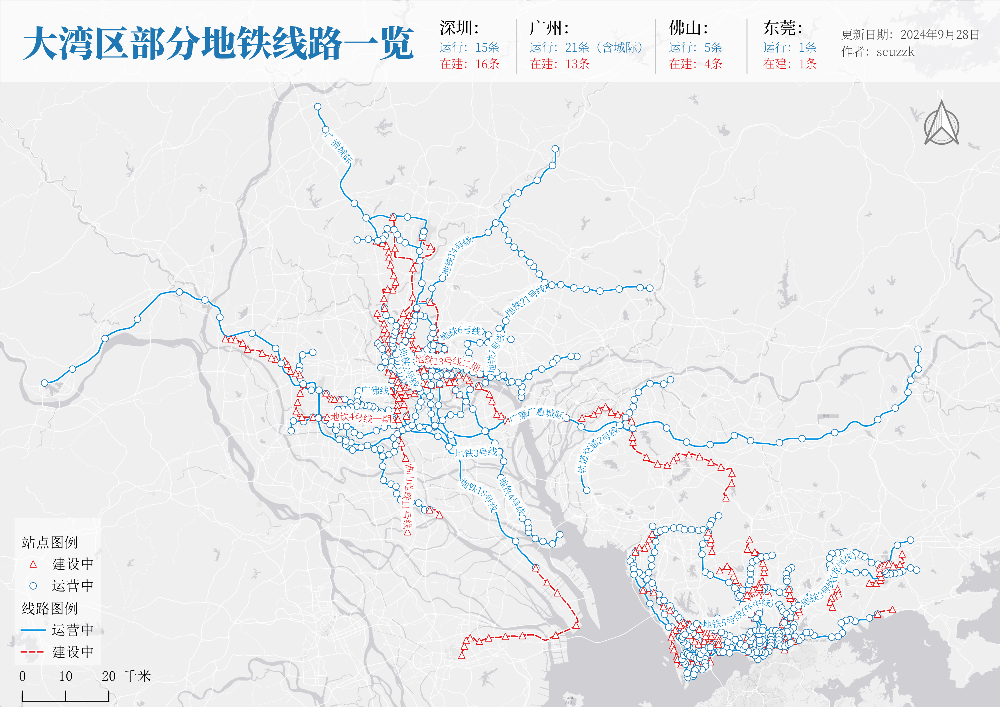
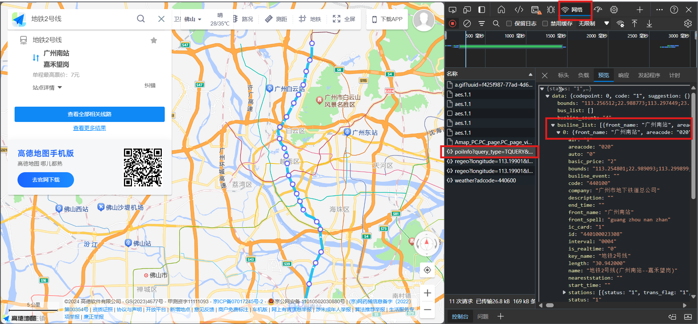

# 🗺️项目介绍

本项目将分享``如何从高德地图上获取并清洗地铁线路矢量数据，将其存储为本地数据``，数据包括**运营中**和**在建地铁**，**并不包括各地规划中尚未修建的地铁线路**。

**注意本项目并非自动化数据采集，需要使用者手动逐一收集更新地铁线路信息，再通过本项目程序清洗原始数据得到最终的矢量数据。**

案例数据如有纰漏还望各位朋友批评指正，作者将及时更新。

# 🗺️数据成果（更新中）

## 🔠数据概况

截止2024年9月28日，本项目已完成**大湾区**四座城市的地铁线路数据整理，其他地区的数据正在更新中⌛...

其中广州区域的地铁数据还包含了广清城际、广肇广惠城际等城际线路，其中广佛线分别存储在广州和佛山两座城市的地铁线路中，如须合并线路数据需要注意剔除重复数据。

| 序号 | 城市名称 | 更新状态 | 线路数量 | 运营中线路数量 | 在建线路数量 | 更新日期 |
|:--:| :--:|:--:|--:|--:|--:|:--:|
| 1 | 深圳 | 在库 | 31 | 15 | 16 | 2024-9-28 |
| 2 | 广州 | 在库 | 34 | 21 | 13 | 2024-9-28 |
| 3 | 佛山 | 在库 | 8 | 4 | 4 | 2024-9-28 |
| 4 | 东莞 | 在库 | 2 | 1 | 1 | 2024-9-28 |

|序号|城市|线路展示|与卫星图比对|
|:--:| :--:|:--:|:--:|
|1|广州|||
|2|深圳|||
|3|佛山|||
|4|东莞|||

## 🔠数据说明及下载

作者根据城市划分不同的地铁线路数据，每个城市命名的文件夹下按照**坐标系类型**、**数据类型**分为不同的文件，有需要的朋友可以根据具体情况使用。

地铁线路数据包含地铁线路名称、线路状态、最早运行时间、最晚运行时间和运营单位。但是由于部分线路数据不完整，可能仅包含线路名称和线路状态属性数据。

数据下载链接可以在最终数据[FinalData](.\FinalData)中下载

### 📋坐标系类型

目前国内常见的地图厂商主要采用**火星坐标系GCJ02（常见于高德地图，后续简单用高德坐标系代指）**、**百度地图坐标系（常见于百度地图）** 和 **WGS84坐标系（常见于卫星底图）**，如果套用不同的底图需要选择相应的坐标系，否则坐标点位可能存在偏移。

### 📋数据类型

本次分享的成果数据格式额外增加了**KML格式**数据，方便大家直接导入奥维地图进行查看。**因为地铁站坐标点数据较多，如没有奥维地图会员将无法实时查看，因此按照城市分别存储。**

# 🗺️准备环节

## 🔠搭建运行环境

本项目程序使用**Python 3**进行编写，并引用了以下第三方库。作者开发过程中使用Anaconda配置环境和管理第三方库，国内用户推荐使用[清华大学开源软件镜像站的安装包](https://mirrors.tuna.tsinghua.edu.cn/help/anaconda/)下载，待完成Anaconda安装后，请确保已经安装配置以下第三方库。需要特别注意，本程序核心引用的第三方库`geopandas`库的配置相对麻烦，可以参考官方教程和编程社区进行配置[geopandas官网](https://geopandas.org/en/stable/getting_started.html)

|序号|库名称|用途|备注|
|:--|:--|:--|:--|
|1|os|用于文件读写||
|2|math|主要在坐标转换阶段使用|本文坐标转换程序主要参考该文档[wandergis/coordTransform_py](https://github.com/wandergis/coordTransform_py/tree/39e54c64cbc61086ea0389368d4909e52aadd2e6)|
|3|json|用于读写原始地铁数据json文件||
|4|geojson|用于读写geojson文件||
|5|geopandas|用于读写geojson文件和转化数据类型|配置难度较高，需要参考官网的指南[geopandas官网](https://geopandas.org/en/stable/getting_started.html)|
|6|shapely|用于配合geopandas处理坐标信息||

## 🔠数据来源分析

### 📋数据获取
在网页打开高德地图，按下F12调出开发者工具，打开网络监听，在搜索栏输入运营中或在建的地铁线路，网页会返回整体的地铁线路数据，通过点击``“预览”``查看名为``poiInfo?query....``的数据能够发现里面包含了线路站点的所有信息，包括线路名称、首末站点名称、地点站名以及坐标点等信息。

### 📋数据格式解析

打开`F12开发者工具`数据预览部分，地铁站点数据主要存储在对象`“data”`的列表`“busline_list”`中，一般会返回2个对象，即图中编号“0”和“1”，代表同一线路往返线路。

不过一般只关注编号为“0”的对象即列表内的第一个对象，后续内容无需重复清洗采集，也可以避免不同城市线路名称重复的问题。

打开编号为“0”的对象，需要重点关注以下值：

|序号|名称|含义|
|:--:|:--:|:--|
|1|company|地铁运营单位|
|2|front_name|起始站点名称|
|3|terminal_name|终点站点名称|
|4|key_name|线路名称|
|5|name|线路全称|
|6|stations|线路站点数据|
|7|status|线路运行状态|

展开`“station”`又可以看到各个站点的数据信息，重点关注以下值：

|序号|名称|含义|
|:--:|:--:|:--|
|1|name|站点名称|
|2|endtime|关闭时间|
|3|station_num|站点序号|
|4|xy_coords|经纬坐标|

### 📋明确运营地铁线路清单

打开高德地图``地铁``图，可以查看当前在运营的全部地铁线路。

但是高德地图并没有集成展示部分城际线路，还是需要到目的地的地铁运营商官网进行查询。例如[**佛山地铁官网**](https://passenger.fmetro.net:31680/mobile/railTransit/index.html)，集成汇总了所有的广佛地铁线路。

### 📋明确在建地铁线路清单

高德地图上会用灰色虚线表示在建地铁线路，点击站点会弹出在建地铁线路名称。在搜索框搜索该地铁，会像运营地铁线路数据一样返回路线相关信息。

关于在建地铁的清单可以通过官方媒体，例如广州地铁官方发布、羊城晚报等官方发布信息，也可关注重点跟踪汇总城市地铁线路建设进度的公众号，比如本项目所参考的清单资料来源与公众号``Metro Bay``，对建设进度有比较详细的节点对比和建设进度点评。

# 🗺️数据清洗

## 🔠整体流程

基本按照如下思路进行数据清洗：
1. 以城市为单位进行线路数据收集，独立创建文件夹；
2. 每条线路独立存储为JSON格式文件；
3. 遍历每条线路数据，提取坐标数据和属性信息，统一汇总到一个GeoJSON文件中，统一按照高德坐标系保存；
4. 根据使用者对文件格式和坐标系统的需求将刚才的GeoJSON文件转化为SHP文件。

## 🔠模块简介

在刚才的流程中能够看到，这个程序将反复使用到以下几个功能，为了方便后期的代码维护，将不同的功能打包为不同的模块，使用者仅需要重点关注`FilePath`以及`Generator`两个功能模块即可。

|序号|名称|作用|
|:--:|:--:|:--|
|1|FilePath|规定程序运行和数据保存地址目录|
|2|JsonReader|获取文件夹下的文件名称清单以及读取json文件|
|3|GetData|从GeoJSON文件中提取出坐标和属性信息|
|4|CoorTrans|完成火星坐标系、WGS84坐标系和百度地图坐标系之间的坐标转换|
|5|Generator|通过调用前面的模块输出得到期望的数据类型和坐标系|

## 🔠修改FilePath模块下的根目录

需要提前设定根目录，赋值在`root`下，需要使用者手动修改为目标目录。

默认根目录下设置`RawData`、`FinalData`两个子文件夹，其中
1. `RawData`用于存储原始地铁Json数据，该文件夹下按照城市名称再创建子文件夹，每条线路独立保存为单独的Json文件

2. `FinalData`用于存储清洗好的地铁线路和站点数据，先按照文件类型创建子文件夹，然后再按照要素类型（点或线）创建文件夹，最后分别按照坐标系类型创建文件夹

## 🔠存储原始Json数据

按照前文的数据来源解析，使用者可将预览里的数据全部折叠，右键点击选择复制，然后在本地目标文件夹下的`RawData`文件夹下新建空白文本，**建议采用地铁线路名称命名**，用记事本打开文件将刚才复制的内容粘贴进去，保存并退出，**再将文件后缀“.txt”更改为“.json”**。

**需要注意，建议数据路径名称全部为英文，同时不要出现空格、特殊字符等标记，以免后续程序运行失败。例如广州地铁1号线数据的地址可以设置为“D:/ProjectName/RawData/Guangzhou/line1.json”**

## 🔠设置输出文件格式和坐标系

打开根目录下的启动程序文件`MetroData`，在当中设定数据格式、要素类型和坐标系统。

该程序默认自动生成高德坐标系下的地铁线路和站点Geojson格式数据文件，后续的数据在此基础上进行转化。

